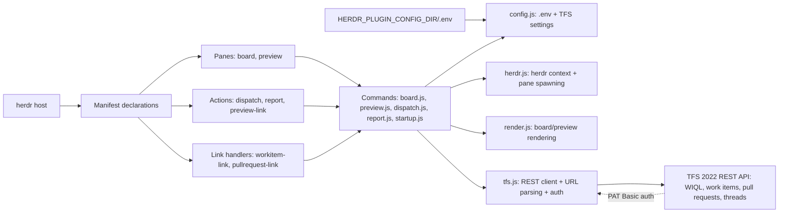
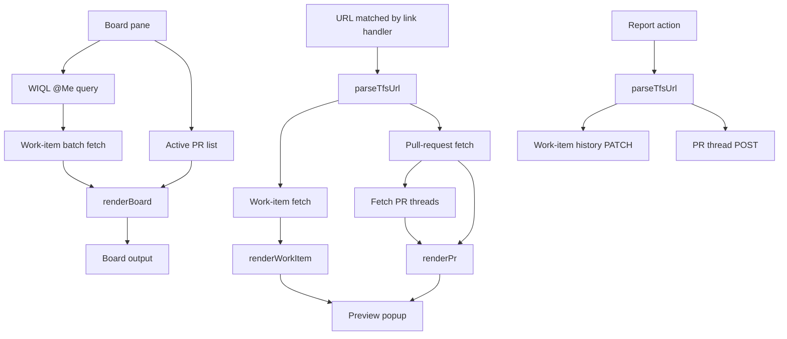

# Azure TFS herdr plugin

Lists assigned, active TFS work items and active pull requests in a split pane,
previews TFS links, and can dispatch a work item to an agent. It targets TFS
Server 2022 REST API 6.0 and uses a PAT with HTTP Basic authentication.

## Install and configure

**Prerequisites:** this repository is a plugin for the `herdr` host (the manifest pins `min_herdr_version = "0.7.0"`); herdr itself is not included and must be installed and on your `PATH`. Plugin configuration is read from `$HERDR_PLUGIN_CONFIG_DIR/.env` — if your environment does not already define `HERDR_PLUGIN_CONFIG_DIR`, export it before the commands below.

```sh
herdr plugin link /path/to/herdrPlugin
mkdir -p "$HERDR_PLUGIN_CONFIG_DIR"
cp .env.example "$HERDR_PLUGIN_CONFIG_DIR/.env"
# edit the TFS URL, collection, project, and PAT
herdr plugin pane open --plugin miguel.azure-tfs --entrypoint board
```

`herdr plugin link` requires an absolute path; a relative path is rejected.
The pane itself is opened with `--entrypoint board` (the pane's manifest
`id`), not `--entrypoint ./commands/board.js` — the plugin manifest declares
`command` (an argv array) for each pane, not an `entrypoint` field; see
[Manifest](#manifest) below.

The URL should be the TFS server root (for example
`https://tfsserver:8080/tfs`), not a project URL. `.env` is deliberately
gitignored. `AZURE_TFS_API_VERSION` defaults to `6.0`.

The host itself sets `HERDR_PLUGIN_CONFIG_DIR` for every plugin command; you
can print the exact path it uses with:

```sh
herdr plugin config-dir miguel.azure-tfs
```

(`config-dir` takes the plugin id as a positional argument, not `--plugin`.)

### Manifest

`herdr-plugin.toml` follows the v1 manifest contract. There is no
`entrypoint` field anywhere in the manifest — panes, actions, and startup
entries all declare `command` as an argv array:

```toml
[[panes]]
id = "board"
title = "Azure TFS board"
command = ["node", "./commands/board.js"]
placement = "split"

[[actions]]
id = "dispatch"
title = "Azure TFS: dispatch work item"
command = ["node", "./commands/dispatch.js"]

[[link_handlers]]
id = "workitem-link"
title = "Azure TFS: work item link"
pattern = "^https?://[^/]+(?:/[^/]+)?/[^/]+/[^/]+/_workitems/edit/[0-9]+/?$"
action = "preview-link"
```

`[[panes]]` require `id`, `title`, `placement`, and `command`. `[[actions]]`
and `[[link_handlers]]` also require a `title` in addition to their other
fields.

## Features

* **Board:** executes a WIQL query for `@Me` and active work items, then lists
  active pull requests. As a pane, `board.js` is a long-lived process: it
  renders once, then redraws on an interval so the pane stays open instead of
  vanishing after a single print. Set `TFS_BOARD_REFRESH_SECONDS` to change
  the interval (default `60`). A value of `0`, or passing `--once` on the
  command line, restores the original print-once-and-exit behaviour (useful
  for scripted/manual invocation or a CI check). Between refreshes the screen
  is cleared and a "Last updated" timestamp is shown. A transient TFS error
  during a refresh is shown in place and retried on the next tick rather than
  killing the pane; a failure on the very first render still exits 1, so a
  misconfigured plugin fails loudly instead of sitting in a broken pane.
  SIGINT/SIGTERM are handled so the pane closes cleanly when killed.
* **Links:** Ctrl+click URLs in the collection/project `_workitems/edit/:id`
  and `_git/:repo/pullrequest/:id` forms to invoke the `preview-link` action.
* **Dispatch:** the `dispatch` action accepts a work-item id (or gets one from
  `HERDR_PLUGIN_CONTEXT_JSON`) and opens a pane with `opencode --prompt ...`.
  Set `TFS_AGENT_COMMAND` to use another agent command.
* **Reporting:** TFS does not expose a stable herdr blocked-event name in the
  plugin contract used here, so the minimal fallback is the `report` action.
  Run it with a TFS URL and status text; it adds work-item history or a PR
  thread. This can be called by a local blocked-event bridge.

### Architecture



### Data flow



### Link URL requirements

Link-handler patterns match both URL forms: with the `/tfs` virtual-directory
segment (`host/tfs/Collection/Project/...`) and without it
(`host/Collection/Project/...`). Servers deployed either way trigger link
handling.

## Tests and mock server

Run the built-in tests (no install or dependencies required):

```sh
npm test
```

The tests start a local HTTP fixture server and verify URL parsing, Basic auth,
WIQL construction, request shape, and rendering. For manual testing, point
`TFS_BASE_URL` in the config `.env` at a local fixture server implementing the
same paths (`/_apis/wit/wiql`, `/_apis/wit/workitems`, and
`/_apis/git/pullrequests`); use a non-TLS `http://127.0.0.1:PORT` URL.

## Publishing

Push this repository to GitHub and add the `herdr-plugin` topic. Keep the
manifest id stable so users' links and configuration continue to work.
