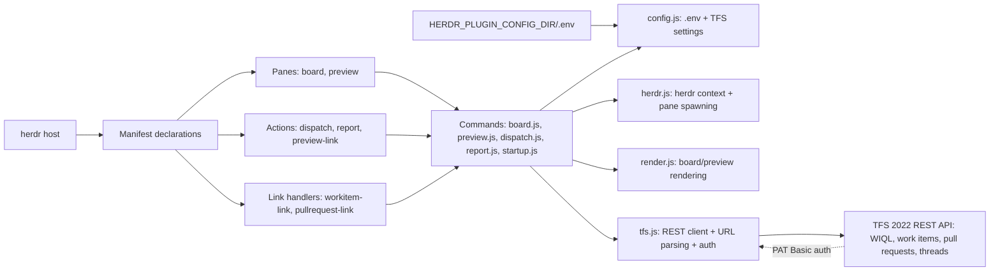
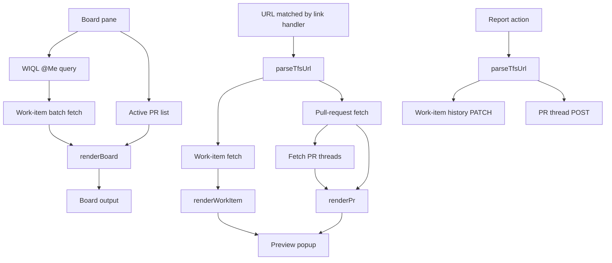

# Azure TFS herdr plugin

Lists assigned, active TFS work items and active pull requests in a split pane,
previews TFS links, and can dispatch a work item to an agent. It targets TFS
Server 2022 REST API 6.0 and uses a PAT with HTTP Basic authentication.

## Install and configure

**Prerequisites:** this repository is a plugin for the `herdr` host (the manifest pins `min_herdr_version = "0.7.0"`); herdr itself is not included and must be installed and on your `PATH`. Plugin configuration is read from `$HERDR_PLUGIN_CONFIG_DIR/.env` — if your environment does not already define `HERDR_PLUGIN_CONFIG_DIR`, export it before the commands below.

```sh
herdr plugin link /path/to/herdrPlugin
mkdir -p "$HERDR_PLUGIN_CONFIG_DIR"
cp .env.example "$HERDR_PLUGIN_CONFIG_DIR/.env"
# edit the TFS URL, collection, project, and PAT
herdr plugin pane open --plugin miguel.azure-tfs --entrypoint board
```

The URL should be the TFS server root (for example
`https://tfsserver:8080/tfs`), not a project URL. `.env` is deliberately
gitignored. `AZURE_TFS_API_VERSION` defaults to `6.0`.

## Features

* **Board:** executes a WIQL query for `@Me` and active work items, then lists
  active pull requests.
* **Links:** Ctrl+click URLs in the collection/project `_workitems/edit/:id`
  and `_git/:repo/pullrequest/:id` forms to invoke the `preview-link` action.
* **Dispatch:** the `dispatch` action accepts a work-item id (or gets one from
  `HERDR_PLUGIN_CONTEXT_JSON`) and opens a pane with `opencode --prompt ...`.
  Set `TFS_AGENT_COMMAND` to use another agent command.
* **Reporting:** TFS does not expose a stable herdr blocked-event name in the
  plugin contract used here, so the minimal fallback is the `report` action.
  Run it with a TFS URL and status text; it adds work-item history or a PR
  thread. This can be called by a local blocked-event bridge.

### Architecture



### Data flow



### Link URL requirements

Link-handler patterns require URLs with the `/tfs` virtual-directory segment
(`host/tfs/Collection/Project/...`). Servers deployed without `/tfs` will not
trigger link handling, even though the internal parser can accept them.

## Tests and mock server

Run the built-in tests (no install or dependencies required):

```sh
npm test
```

The tests start a local HTTP fixture server and verify URL parsing, Basic auth,
WIQL construction, request shape, and rendering. For manual testing, point
`TFS_BASE_URL` in the config `.env` at a local fixture server implementing the
same paths (`/_apis/wit/wiql`, `/_apis/wit/workitems`, and
`/_apis/git/pullrequests`); use a non-TLS `http://127.0.0.1:PORT` URL.

## Publishing

Push this repository to GitHub and add the `herdr-plugin` topic. Keep the
manifest id stable so users' links and configuration continue to work.
